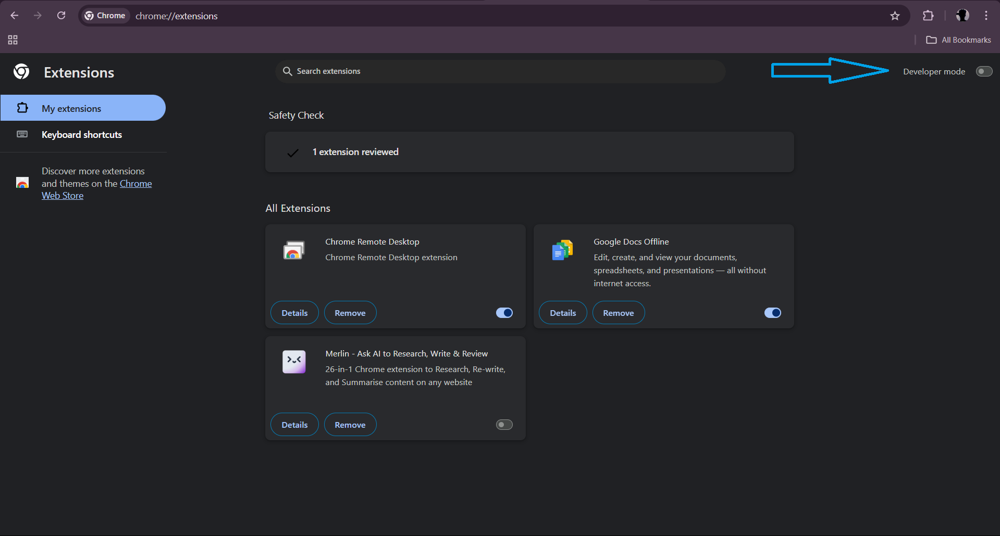
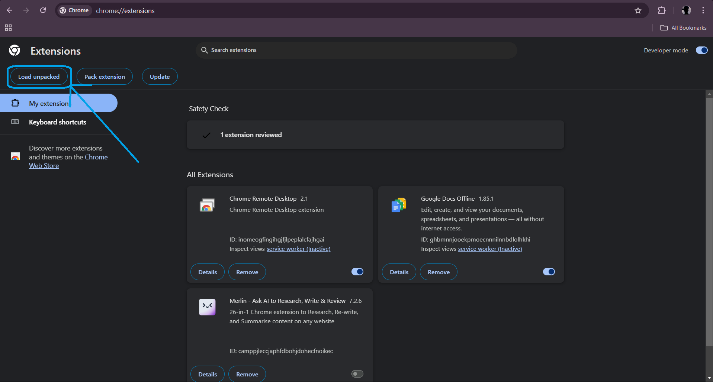
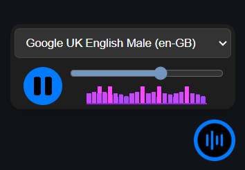
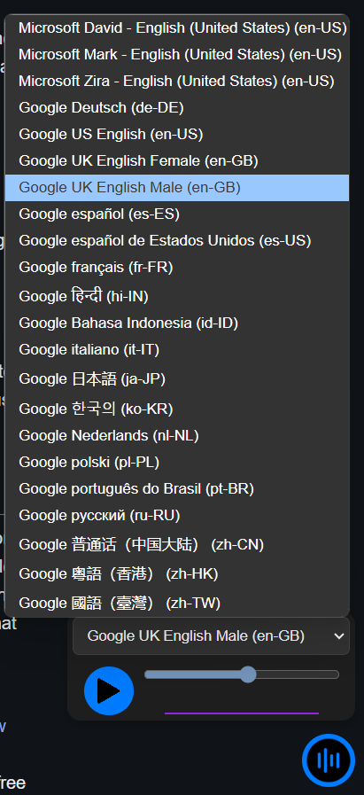

# HearText

This Chrome extension allows users to translate selected text into speech and customize the experience with various voices and speech rates. It features play and pause functionality for convenient access.

## Features

- **Text-to-Speech Conversion**: Convert any selected text into speech.
- **Voice Selection**: Choose different voices available in the browser's speech synthesis service.
- **Speech Rate Adjustment**: Modify the speed at which the text is spoken.

- **Play and Pause Functionality**: Easily control speech playback.
- **User-Friendly Interface**: Intuitive controls for seamless interaction.
- **Automatic Theme Switching**: The extension's interface automatically adapts to match the system's theme (light or dark), providing a seamless and consistent user experience.

## Getting Started

### Prerequisites

- Google Chrome installed on your computer.
- Internet connected.

### How to clone

1. Open your terminal/command prompt.
2. Run the following command to clone the repository:
   ```bash
   git clone https://github.com/Jay0073/HearText.git
   ```

### How to load the extension

1. Open Google Chrome.
2. Go to `chrome://extensions/`
3. Enable "Developer mode" by toggling the switch in the top right corner.
      

5. Click on the "Load unpacked" button.
      

7. Select the directory where your cloned repository is located.

## How to use the extension

1. After loading the extension, you will see a small button in the bottom right corner of your browser.
2. **Selecting Text**: Highlight any text on a webpage that you wish to be read aloud.
   
   <video controls src="https://github.com/user-attachments/assets/61dca9b3-8c24-4e51-b572-b65c608202f1"> </video>
4. **Open Controls**: Click the floating button to open the TTS controls popup.

   
6. **Choose Voice**: Select your preferred voice from the dropdown list.

   
8. **Adjust Speech Rate**: Use the slider to set your desired speech rate.
9. **Play Text**: Click the play button to start reading the selected text.
10. **Pause/Resume**: Click the play button again to pause or resume playback.

## Unloading the extension

1. Go to ` chrome://extensions/`
2. Find your extension in the list.
3. Click on the "Remove" button to unload the extension.

## Additional Notes

- The extension uses the Web Speech API to convert text to speech, which relies on the voices installed in the browser. Available voices may vary depending on the operating system and language settings.
- Users can customize settings such as speech rate and selected voice, which are saved in local storage, allowing for persistence across sessions.

## Contribution

If you'd like to contribute to this project, please fork the repository and submit a pull request.
